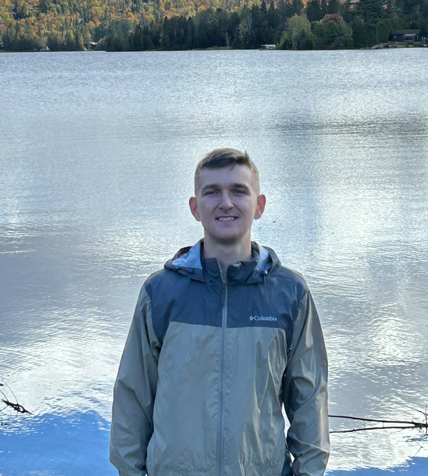
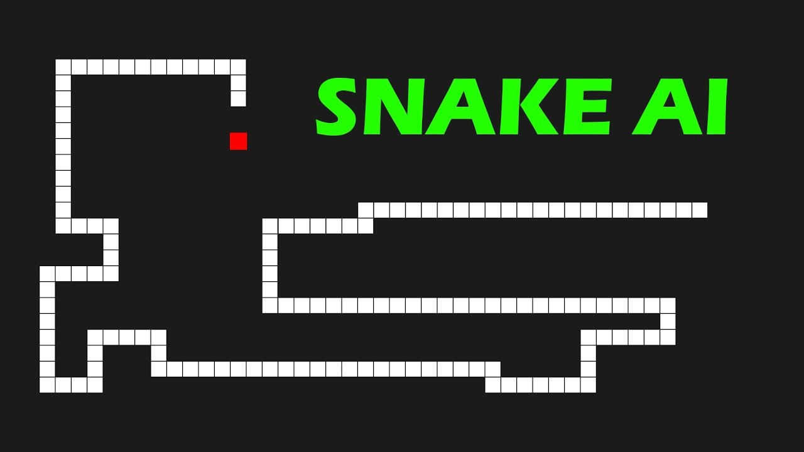

# Alexander Chneerov Portfolio

Welcome to Alexander Chneerov's portfolio! This portfolio showcases my skills, projects, and experiences as a passionate developer based in Montreal, Canada.

## Credits

This portfolio is built upon the template created by [nisarhassan12](https://github.com/nisarhassan12). You can find the original template in his [GitHub Repo](https://github.com/nisarhassan12/portfolio-template/) and learn more about him on his [Website](https://nisar.dev).

## Table of Contents

- [Introduction](#introduction)
- [My Work](#my-work)
  - [Ozone](#ozone)
  - [Snake AI](#snake-ai)
  - [InfoCar](#infocar)
- [About Me](#about-me)
- [Get in Touch](#get-in-touch)
- [Connect with Me](#connect-with-me)

## Introduction

I am Alexander Chneerov, a computer science student at Concordia University in Montreal. With a passion for coding, I have participated in hackathons, won awards, and developed projects like Ozone, Snake AI, and InfoCar. My expertise lies in languages like Python and JavaScript, and I specialize in frameworks such as Flask and Node.js. Beyond coding, I am an avid camper, finding inspiration in the outdoors. Let's innovate and explore together!

## My Work

### Ozone

Led a collaborative effort to develop a comprehensive video management and filtration software tailored for enterprise applications. This involved creating innovative filtration elements and settings in Swift, resulting in a remarkable 50% reduction in RAM usage. Additionally, honed effective communication skills through consistent participation in weekly team meetings.

**Technologies Used:**
- Swift
- Xcode
- GitHub

### Snake AI

Orchestrated the development of a Python-based Snake game environment using PyGame, seamlessly integrating advanced AI capabilities. Implemented a Deep Q-Network (DQN) using PyTorch to empower the AI for decision-making within the game. Skillfully managed the Q-learning training processes and orchestrated agent interactions, resulting in a dynamic and intelligent gaming experience.

**Technologies Used:**
- Python
- PyTorch
- Deep Q-learning

[Visit Github &rarr;](https://github.com/achneerov/pygame-reinforcement-learning)

### InfoCar

Engineered a dynamic Flask-based vehicle history web application using Python and Selenium. Integrated real-time recall data by proficiently scraping information from car manufacturer websites, ensuring users have access to the latest information. Crafted an intuitive and user-friendly interface using a combination of HTML, CSS, and JavaScript, enhancing the overall user experience.

**Technologies Used:**
- Python
- Selenium
- Flask
- HTML
- CSS
- JavaScript

[Visit Github &rarr;](https://github.com/achneerov/InfoCar)

## About Me

Hey, I'm Alexander Chneerov, a computer science student at Concordia University in Montreal. From winning hackathons to developing projects like Ozone and InfoCar, I thrive on coding challenges. Skilled in languages like Python and JavaScript, I specialize in frameworks such as Flask and Node.js. Beyond coding, I'm an avid camper, finding inspiration in the outdoors. Check out my projects on GitHub or connect with me on LinkedIn. Let's innovate and explore together!

## Get in Touch

Whether you need a speedy and user-friendly developer for your product or business, need consultation, have questions, advice, or simply want to say "Hi 👋," feel free to reach out! I'm committed to fast responses, and the quickest way to contact me is through email.

**Email:** [achneerov@gmail.com](mailto:achneerov@gmail.com)

## Connect with Me

- [Twitter](https://twitter.com/achneerov)
- [GitHub](https://github.com/achneerov)
- [LinkedIn](https://www.linkedin.com/in/achneerov/)

Feel free to connect and explore more about my journey and projects. Looking forward to connecting with you! 😊
